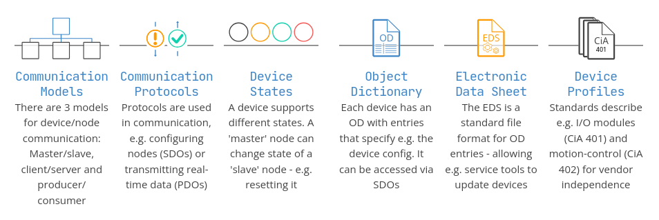

## Introduction

CanOpen is a broadcast protocol. 
CanOpen splits the network up into individual nodes and each node has multiple functions, the combination of a node ID and a function produce what is known as a COB ID.
A particular node sends a command, the command is received by all nodes. 
Acceptance filters within the nodes determine if the node cares about a packet or not.
In theory CanOpen supports up to 127 individual nodes.

Protocole handling 5 out of the 7 layers of the ISO model ;
- Application
- Presentation
- Session
- Transport
- Network
(Layers from higher to lower)

To do so need a lots of thing in this protocole as shown in screens below

*The steps behind the CANopen protocol* 

*The organization of a process*

## Object Dictionnary (OD)

Each CANopen device (called node) is defined by an Object Dictionary used for config & comms, which contains all the data that will be transferred to other nodes.

The keys of this dictionary are :
- **Index** : the address of the node on 2 bytes (i.e. how to access to this device's dico for parts of the protocol that interact with the node)
- **Name** : the name of the device
- **Object type** : Array, variable, or record
- **Data  type** : give the type of the data handled by the device (e.g. VISIBLE_STRING, or UNSIGNED32 or Record Name)
- **Access (SDO ?)** : read/write (rw), read only (ro) or write only (wo)
- **Mandatory/Optional (M/O)** : defines if a device conforming to the device specification has to implement this object or not

## Communication 

*3 communication functions of CANopen*

### The CANopen frame (packet)

The smaller the COB-ID is the more important it is.
The remote transmission request (RTR) is discouraged to be used in CANopen (it's more like a CAN used feature) 

**[CANopen COB-ID converter](https://www.csselectronics.com/pages/canopen-tutorial-simple-intro) 

## CANopen Functions
There's always a function attached to a CANopen packet. 
It's defined by the first 4 bits of the frame

**Here is a summary of every sub protocoles and there COB-ID : **

| Communication object         | COB-ID                                                                                                                                                             | Slaves nodes                                                                                                                                                   |
| ---------------------------- | ------------------------------------------------------------------------------------------------------------------------------------------------------------------ | -------------------------------------------------------------------------------------------------------------------------------------------------------------- |
| NMT node control             | 0x000                                                                                                                                                              | Receive only                                                                                                                                                   |
| Global failsafe command      | 0x001                                                                                                                                                              | None                                                                                                                                                           |
| Flying master                | 0x071 to 0x076                                                                                                                                                     | None                                                                                                                                                           |
| Indicate active interface    | 0x07F                                                                                                                                                              | None                                                                                                                                                           |
| Sync                         | 0x080                                                                                                                                                              | Receive only                                                                                                                                                   |
| Emergency                    | 0x080 + Node-ID                                                                                                                                                    | Transmit                                                                                                                                                       |
| TimeStamp                    | 0x100                                                                                                                                                              | Receive only                                                                                                                                                   |
| Safety-relevant data objects | 0x101 to 0x180                                                                                                                                                     | None                                                                                                                                                           |
| PDO                          | 0x180 + Node-ID   0x200 + Node-ID   0x280 + Node-ID   0x300 + Node-ID   0x380 + Node-ID   0x400 + Node-ID   0x480 + Node-ID   0x500 + Node-ID | 1. Transmit PDO   2. Receive PDO   3. Transmit PDO   4. Receive PDO   5. Transmit PDO   6. Receive PDO   7. Transmit PDO   8. Receive PDO |
| SDO                          | 580 + NodeID   600 + NodeID                                                                                                                                     | Transmit   Receive                                                                                                                                          |
| Dynamic SDO request          | 6E0                                                                                                                                                                | None                                                                                                                                                           |
| Node claiming procedure      | 6E1 to 6E3                                                                                                                                                         | None                                                                                                                                                           |
| Node claiming procedure      | 6F0 to 6FF                                                                                                                                                         | None                                                                                                                                                           |
| NMT node monitoring          | 700 + NodeID                                                                                                                                                       | Transmit                                                                                                                                                       |
| LSS                          | 7E4   7E5                                                                                                                                                       | Transmit   Receive                                                                                                                                          |

### Explanation of the most imporant sub-protocoles

#### NMT protocol
COB-ID = 0x000
Because the Node-ID is 0 the packet will be processed by every slaves on the network but as explained below not all of them will have to do something after receiving this packet.

- Start up and shut down function sent by the master to slaves

A NMT packet look like this :

| COB-ID | Byte 0          | Byte 1      |
| ------ | --------------- | ----------- |
| 0x000  | Requested state | Target node |
**Requested state :** make the node transit to operational state (01), stopped state (02), pre-operational state (80), application reset (81) or reset communication (82).
**Target node :** the ID of the targeted node.

### Sync protocol
COB-ID = 0x080

- The SYNC message is used e.g. to synchronize the sensing of inputs and actuation of several CANopen devices

The master broadcast the SYNC message and the slaves that are configured to react, respond by transmitting input data captured at the very same time or by setting the output at the very same time as the nodes participating in the synchronous operation.

### Emergency protocol
COB-ID = 0x080 + node ID

- Used to transmit critical data or event (e.g. a sensor failure) emitting from a node.

The packet can come from any node and not just the master unlike the SYNC function. This packet has a high priority in the network and his data bytes contains informations about the occurring error.

### Process Data Object (PDO) protocol
COB-ID = 0x180, 0x200, 0x280, 0x300, 0x380, 0x400, 0x480 or 0x500 + Node ID

- Send data to one node's OD to another, this function is very flexible as the values, update rate and behaviours are programmable. There's up to 8 data bytes (payload) in each PDO packets and those bytes can be filled with any information contained in the OD's sending node

An example of what can be in a PDO packet is : if you have you have 2 data taking 4 bytes and one taking 1 byte in an object dictionnary you can fill the packet with the two 4 bytes length data or mix one 4 bytes data with the 1 byte data or just send a single data depending of your need.
To do so PDOs are configured in pairs with a matching TX (transmitter) and RX (receiver) PDO.

The TX PDO is controlled by 2 Object Dictionary entries as well as the RX PDO, even though they are not depending on the same entries, the format of those entries need to be identical between nodes.
The entries of the TX PDO specify which OD's entries will be sent into the packet.
The entries of the RX PDO specify where in the receiving Object dictionary the data will go.

Here is how a simple TX PDO would be composed :

| Sub index | Description             | Size      |
| --------- | ----------------------- | --------- |
| **0**     | **Number of Sub index** | **Bytes** |
| 1         | COB ID                  | 4 bytes   |
| 2         | Type                    | Byte      |
| 3         | inhibit time (ms)       | 2 Bytes   |
| 5         | event timer (ms)        | 2 Bytes   |

The RX PDO would only contains the lines of Sub index 0 and.

The type field specify when the PDO is transmitted : 

| Type    | Description           |
| ------- | --------------------- |
| 0       | Acyclic synchronous   |
| 1-240   | Cyclic symchronous    |
| 241-251 | Reserved              |
| 252     | Synchronous RTR only  |
| 253     | Asynchronous RTR only |
| 254-255 | Asynchronous          |

the PDOs of type Asynchronous are transmitted whenever the value that the mapping parameter refers to changes, to avoid too frequent update we can increase the inhibit time, and to transmit data automatically after a certain time we just have to tweak the event timer. 
Cyclic Synchronous PDOs are transmitted with the SYNC message. In fact the SYNC message causes all nodes with Synchronous PDOs configured to sample their inputs and store the data, the actual data is transmitted on the next SYNC message.
Acyclic synchronous only transmit data when a Remote request from another device ‘pre-triggers’ the PDO or when a specific event ‘pre-triggers’ the PDO.
The modes involving RTR work the same way except Synchronous RTR requires a SYNC message and an RTR packet where as Asynchronous RTR only requires the RTR packet.

### Service Data Object (SDO) protocol
COB-ID = 0x580, 0x600 
respectively the transmit and the receive but because who's who between TX and RX is defined from the slave's point of view so to query a device on the network you would send a 0x600+node ID and get back a 0x580+node ID

- Used to read or write in an other node's OD. If the data is less than 8 bytes long it's just expedited, if it's not then multiple handshakes are used to transfer all the data. In any case its the reception of each packet must be confirmed 
- Useful for configuration because allowed in pre-operation mode. 

A SDO packet look like this :

| COB-ID          | rtr | len | Byte 0  | Byte 1 | Byte 2 | Byte 3    | Byte 4  | Byte 5  | Byte 6  | Byte 7  |
| --------------- | --- | --- | ------- | ------ | ------ | --------- | ------- | ------- | ------- | ------- |
| 0x600 + Node-ID | 0   | 8   | Command | Index  | Index  | Sub-index | payload | payload | payload | payload |

COB-ID + rtr bit + len's 4 bits make a header of 16 bits which make a total length of the packet of 10 bytes.\
The command byte is constructed like shown below :

| Bit 0 | Bit 1 | Bit 2 | Bit 3 | bit 4 | Bit 5 | Bit 6 | bit 7 |
| ----- | ----- | ----- | ----- | ----- | ----- | ----- | ----- |
| CCS   | CCS   | CSS   | 0     | n     | n     | e     | s     |

**CCS (Client Command Specifier) :** indicate if the it's a read or a write.
**n :** is the amount of bytes that **do not** contains data (need e and s set to be valid).
**e :** indicate if it's an 'expedited transfer' i.e. all data to be transferred is in this packet.
**S :** make the e valid to show that the data size is in it.
 
Here is what the architecture of a SDO network look like :

If there's more than 4 bytes of data to transmit then a segmented transfer is used, it means packets are requested to be sent after the first one to complete the data and most of the time each one of those following packets are acknowledged upon reception. There's also an option where all the packet are sent and only one confirmation of the reception is sent at the end of the transfer. The choice of how the others data's bytes are transmitted is made after reception of the first one and is specified in the response to that first package.

### Guard protocol
COB-ID = 0x700 + Node ID

- Used to check if a node is okay (either while being used or after start up)
	To do so we can either use the heartbeat principle, where each nodes prove that they are alive by sending a guard packet to the NMT master when a certain amount of time has passed, or the node-guarding principle where the checked node have to respond to the NMT master within a certain time frame or it will be considered dead.

A guard packet look like that :  

| Can Header      | rtr | len  | State                        |
| --------------- | --- | ---- | ---------------------------- |
| 0x700 + Node-ID | 0   | 0001 | 1 bit toggle + 7 bits status |
 
 And the 7 bits status can take the values :

| Values | Meaning         |
| ------ | --------------- |
| 0x00   | Boot            |
| 0x04   | Stopped         |
| 0x05   | Operational     |
| 0x7f   | Pre-operational |

An Object Dictionary defining how is working the guarding handled by the Master would look like this :

| Entry  | Array | Meaning                                                                                  | size in bits |
| ------ | ----- | ---------------------------------------------------------------------------------------- | ------------ |
| 0x1017 | No    | Heart beat producer time in ms                                                           | 16           |
| 0x1016 | Yes   | Heartbeat Consumer                                                                       | 32           |
| 0x100C | No    | Guard Time                                                                               | 16           |
| 0x100D | No    | Lifetime factor                                                                          | 8            |
| 0x100E | No    | node guarding identifier (not required to be implemented) defaults to 0x700 + node id | 16           |

### Biblio
- https://www.csselectronics.com/pages/canopen-tutorial-simple-intro#sdo-service-data-object
- https://en.wikipedia.org/wiki/CANopen#Service_Data_Object_(SDO)_protocol
- https://web.archive.org/web/20191219153622/http://www.byteme.org.uk/canopenparent/canopen/

