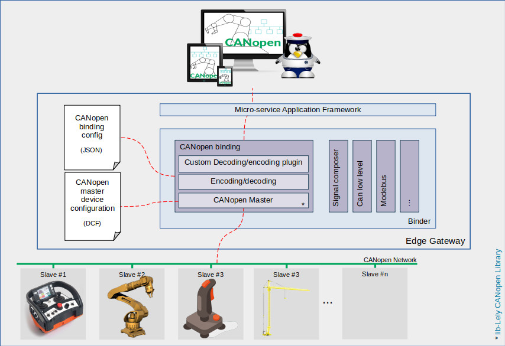

# CANopen Binding

This binding allows the control of a CANopen field network from a Redpesk type system. It handle different formats natively (int, float, string...) but can also handle custom formatting using custom decoding/encoding plugins.
It act as a master on the CANopen bus and is generated and handled via the [(open source industrial c++ library Lely)](https://opensource.lely.com/canopen/).

To work, this binding require a master DCF file in witch is described the slaves object dictionary, and a JSON fil that describe the behavior of the binding and reference the sensors (more information about it in the configuration chapter).

* [Installation Guid](./2-installation_guide.html)
* [Running and Testing](./3-running_and_testing.html)
* [Configuration](./4-configuration.html)
