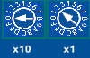
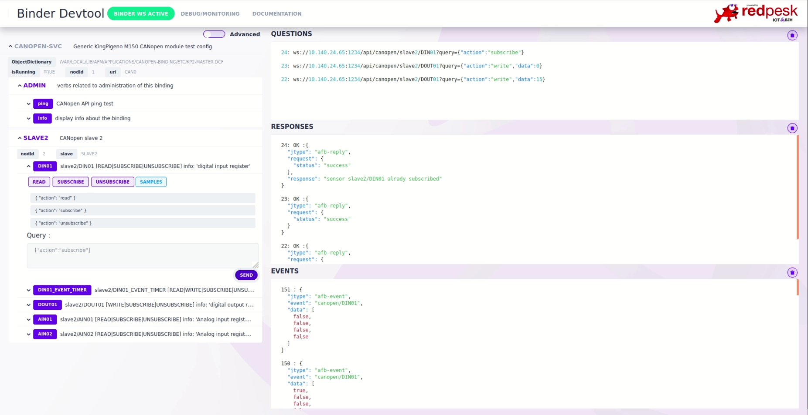

# Running/Testing

This test example is based on a King Pigeon Industrial CANopen IO Module. Cabling example and documentation are available on [Device Store / King Pigeon]() chapter of the redpesk documentation.

This test example presumes that your device is set to bitrate = 20000 {:: style="margin: auto; display: initial; height: 50px; width: auto;"}
and nod id = 2 {:: style="margin: auto; display: initial; height: 50px; width: auto;"}

## Set up device

Set up your can connection with the right can channel (usually can0) and a bit rate corresponding to your device setting (in this case 20000).

```bash
sudo ip link set can0 type can bitrate 20000
```

Open your connection :

```bash
sudo ip link set up can0
```

By default on linux, physical can, TX queue length is 10. But lely lib require a minimum TX queue length of 128. you can set it to 1024 to be safe :

```bash
sudo ip link set can0 txqueuelen 1024
```

## Start Sample Binder

Be sure to be in the build directory and run :

```bash
afb-binder --name=afb-kingpigeonM150-config --port=1234  --binding=src/lib/afb-CANopen.so --workdir=package --verbose
```

or if you installed it (from package or with make install)

```bash
export CANOPEN_BINDING_DIR=/var/local/lib/afm/applications/canopen-binding
afb-binder \
--name=afb-kingpigeonM150-config \
--port=1234 \
--binding=$CANOPEN_BINDING_DIR/lib/afb-CANopen.so \
-vvv
```

## Test with web UI client

install `afb-ui-devtools`

open binding UI with browser at `http://localhost:1234/devtools/index.html`



## Test with afb-client

install `afb-client`

run it :

``` bash
afb-client --human 'ws://localhost:1234/api'
# you can now send requests with the following syntax : <api> <verb> [eventual data in json format]
# here are some available examples for canopen binding :
canopen ping                                        # Answer pong
canopen info                                        # Return information about the binding and available verbs
canopen slave2/DOUT01 {"action":"write", "data":15} # Write 0b1111 on digital output 01 of slave 2
canopen slave2/DIN01 {"action":"read"}              # Read digital input 01 state of slave 2
canopen slave2/DIN01 {"action":"subscribe"}         # Subscribe to digital 01
...
```

for more option use `afb-client --help`

## Adding your own config

Json config file is selected from `afb-binder --name=afb-midlename-xxx` option. This allows you to switch from one json config to an other without editing any file. `middlename` is used to select a specific config. As example `--name='afb-kpM15-config'` will select `canopen-kpM150-myconfig.json`.

You may also choose to force your config file by exporting CONTROL_CONFIG_PATH environnement variable. For further information, check AGL controller documentation [here]()

```bash
# for exemple :
# $HOME
# └── my-config
#     ├── canopen-myconfig-config.json
#     └── my-master.dcf

export CONTROL_CONFIG_PATH="$HOME/my-config"
afb-binder --name=afb-myconfig --port=1234  --binding=src/lib/afb-CANopen.so --verbose
```
